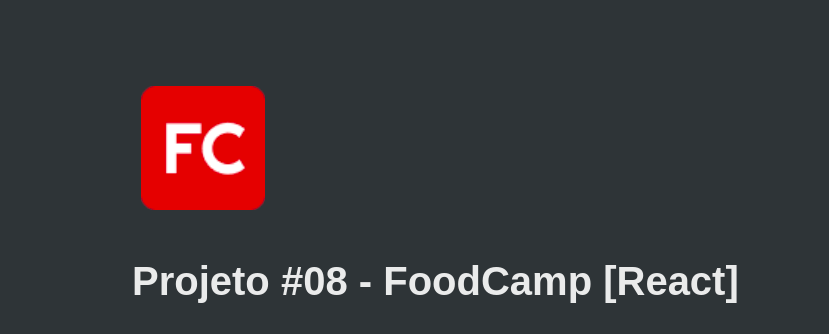
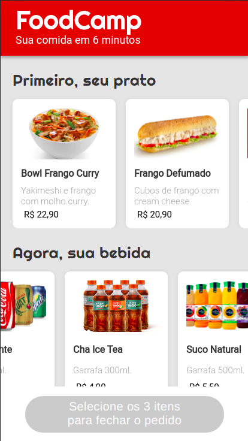
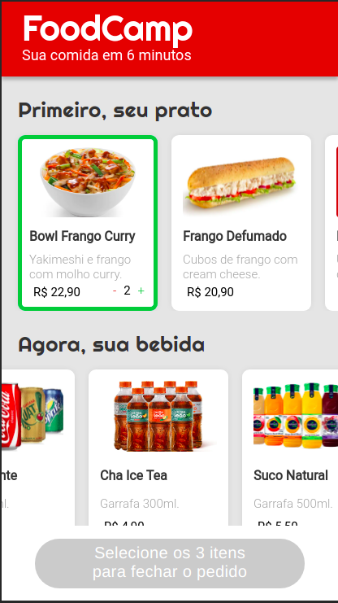
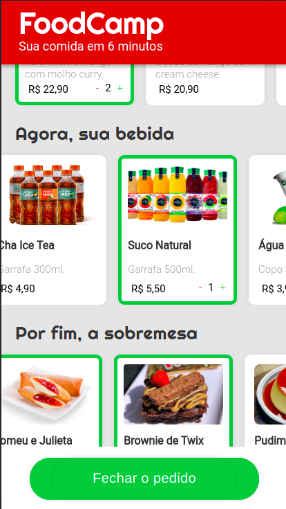

<h1 align="center">
    
</h1>

<h1 align="center">
    <a href="#">FoodCamp</a>
</h1>

  
   
   

<h4 align="center"> 
	 Status: Delivered.
</h4>

## About

FoodCamp is an easy and fast way to order a meal.  
Project developed during ** Bootcamp Responde Aí ** offered by [Responde Aí](https://www.respondeai.com.br/).  
The focus of this project is to further develop Front End skills and to learn React, states and componentization, changing from pure JavaScript to React, also using HTML5, CSS3.

---

## Features

- [x] Mobile Layout

- [x] Homepage experience:

  - [x] Loads foods, drinks and desserts options;
  - [x] Can select how many meals you want!
  - [x] After at least one option from each category is selected, order button becomes available.

- [x] Purchase experience
  - [x] When order button is clicked, user gets redirected to WhatsApp with the order message ready to send;

---

## Layout

The application layout is available on Figma:

### Mobile

  
  
  

## Tech Used

The following tools were used in the construction of the project:

- ****
- ****
- ****
- ****

#### **Utilities**

- Prototype: **[Figma](https://www.figma.com/)** → **[Protótipo (FoodCamp)](https://www.figma.com/file/nkRQD9TcxvzLQFO27JsGV1/FoodCamp-%5BReact%5D?node-id=0%3A1)**
- Editor: **[Visual Studio Code](https://code.visualstudio.com/)**
- Deploy: **[Vercel](https://vercel.com/)**
- Fonts: **[Roboto](https://fonts.google.com/specimen/Roboto)**

---

## Authors

<a style="border-radius: 50px;" width="100px;" href="https://github.com/lucasmoraismt">
 
  
 <b>Lucas de Morais</b></a>
  

## 

## License

This project is under the license [MIT](./LICENSE).

👋🏽 Get in Touch!

---
